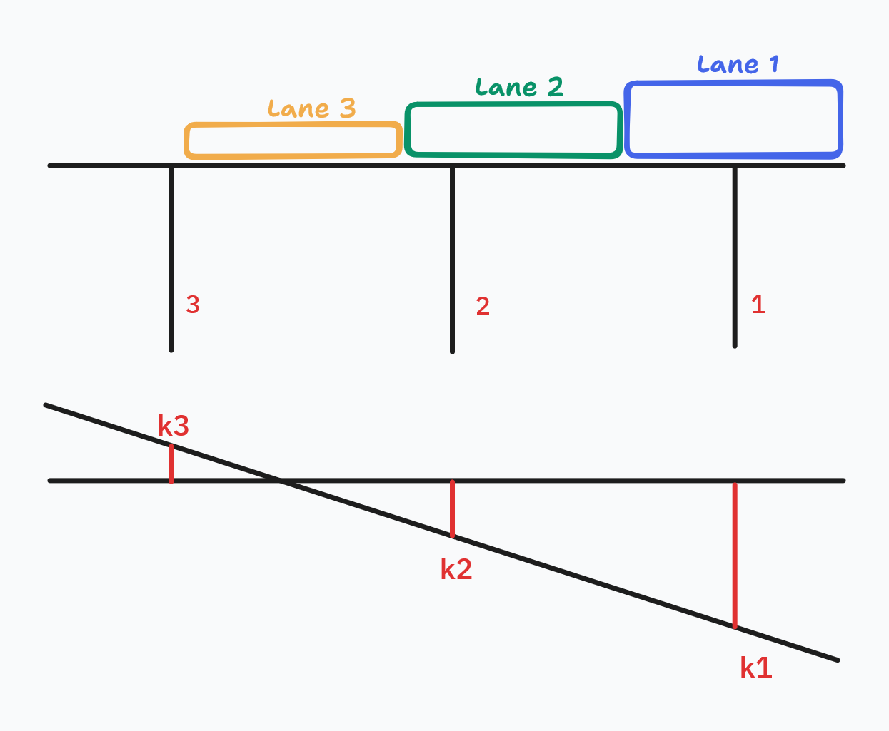

# pyBridgeLD - Python Bridge Load Distribution

`pyBridgeLD` is a python library that calculate the load distribution on a generic bridge cross section.

<p align="center">
  
</p>

## Installing
You can install using pip:

```
pip install pyBridgeLD
```

and import with:

```python
import pyBridgeLD as pybld
```


## Features

- ☑ Definition of transversal geometry configuration
- ☑ Definition of longitudinal geometry configuration
- ☑ Definition of generic vehicle, with concentrated and/or distributed load
- ☑ Definition of traffic load configuration, with single or multiple vehicles

- ☑ Courbon theory of load distribution
- ☐ Engesser theory of load distribution
- ☐ Guyon-Massonnett-Bares theory of load distribution


## Examples
You can find some examples of usage in examples folder:

- [**Example n.1**](https://github.com/RoccoRaimo/pyBridgeLD/blob/main/docs/Notebooks/Example_1.ipynb): Basic import and usage of library with a simple application of Courbon theory for bridge load distribution;

## License

Distributed under the terms of the [MIT license](https://github.com/RoccoRaimo/pyBridgeLD/blob/main/LICENSE), `pyBridgeLD` is free and open source software.
